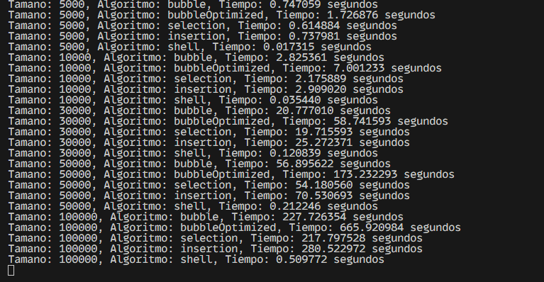
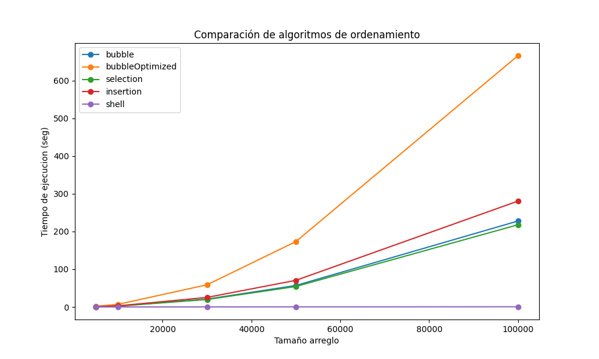

# Práctica de la Teoría de la Complejidad

## 📌 Información General

- **Título:** Práctica de la Teoría de la Complejidad
- **Asignatura:** Estructura de Datos
- **Carrera:** Computación
- **Estudiante(s):** Andres Villalta & Sebastian Lopez
- **Fecha:** 11 de mayo del 2025
- **Profesor:** Ing. Pablo Torres

---

## 🛠️ Descripción

Este proyecto implementa los metodos de ordenamientos revisados, de los cuales se realizara la medicion de sus respectivo tiempos empleados haciendo uso aplicando metodos de benchmarking.

Los resultados obtenidos seran recopilados y posteeriormente mostrados en pantalla, ademas de presentar un grafico elaborado en donde se podra apreciar de mejor manera el rendimiento de cada uno.

---

## 🚀 Ejecución

Para ejecutar el proyecto:

1. Compila el código:
    ```bash
    javac App.java
    ```
2. Ejecuta la aplicación:
    ```bash
    java App
    ```

---

## 🧑‍💻 Ejemplo de Salida

```plaintext
Tamano: 5000, Algoritmo: bubble, Tiempo: 0.747059 segundos  
Tamano: 5000, Algoritmo: ... 

Tamano: 10000, Algoritmo: bubble, Tiempo: 2.825361 segundos  
Tamano: 10000, Algoritmo: ...

Tamano: 20000, Algoritmo: bubble, Tiempo: 20.777010 segundos  
Tamano: 20000, Algoritmo: ...  

Tamano: 50000, Algoritmo: bubble, Tiempo: 56.895622 segundos  
Tamano: 50000, Algoritmo: ...

Tamano: 100000, Algoritmo: bubble, Tiempo: 227.726354 segundos  
Tamano: 100000, Algoritmo: ...  
```

---

## 📷 Resultado Esperados




## ✍️ Conclusiones del Analisis

 - Los resultados obtenidos de los diferentes metodos empleados, dan a conocer que los metodos con una complejidad O(n^2), refiriendonos al metodo de Burbuja Mejorado, Seleccion e Insercion, son algoritmos los cuales escalan desafavorablemente conforme aumenta el tamaño del arreglo. Esto lo demuestro los tiempo con crecimiento no lineal de dichos metodos, es especial si hablamos de los arreglos de 50.000 elementos o mas, justamente donde el tiempo de ejecucion se eleva cosiderablemente. Aunque el metodo de Insercion muestre un rendimiento apropiado entorno a arreglos relativamente pequeños, de todas formas se ve afectado frente a entradas de datos masivos.

- Por el contrario, el metodo Shell presenta una complejidad de O(n log n), mantiene a lo largo de la ejecucion un mejor rendimiento bastante notorio en contraste con los demas metodos, incluso si se trata de arreglos grandes hablando de 100.000 elementos. Demonstrando que referirse a la eficiencia de un algoritmo vas mas alla de los teorico, sino a lo practico, de tal forma que se facilite la eleccion de algun algoritmo y su nivel de complejidad conforme al arreglo propuesto.

## 📎Enlace Repositorio Github
https://github.com/AndrssWV/PL-TeoriaComplejidad
